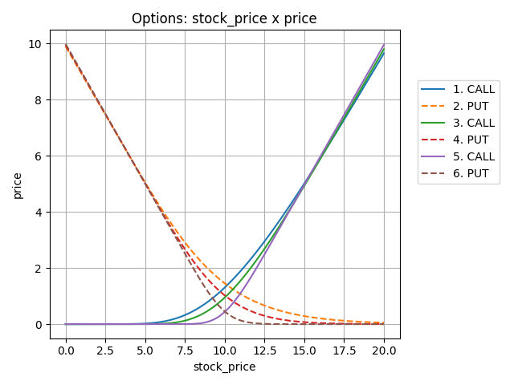
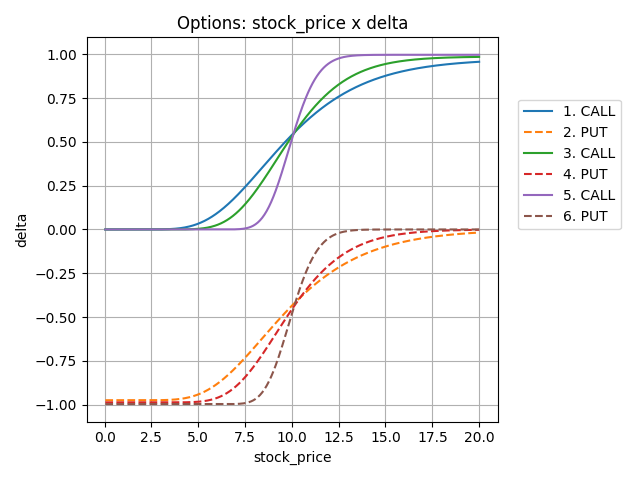
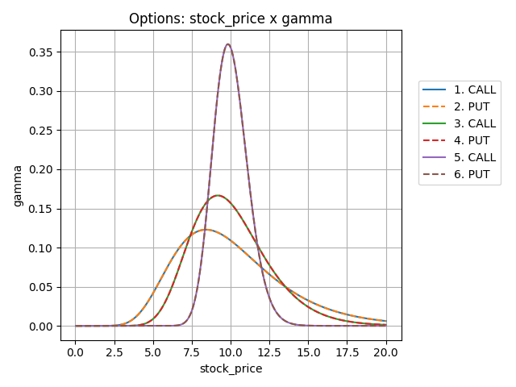
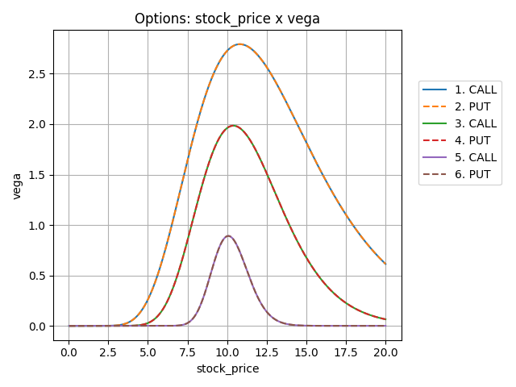
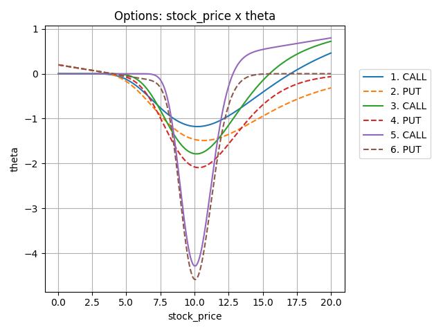
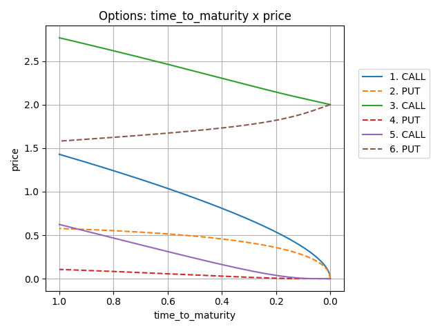
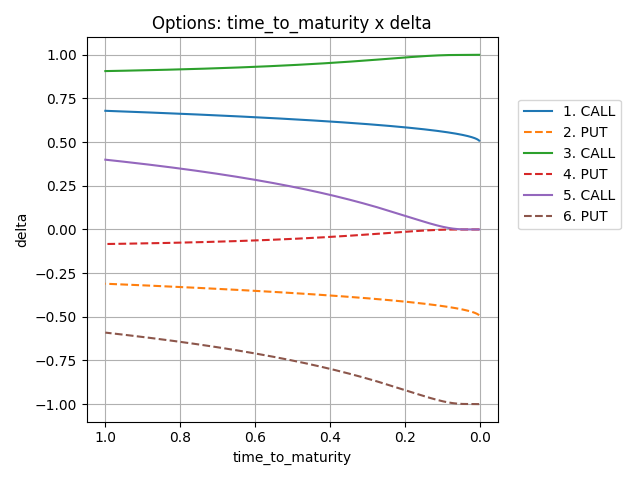
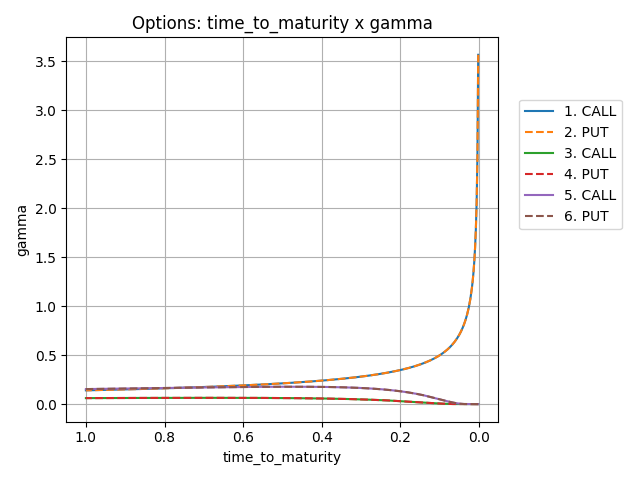
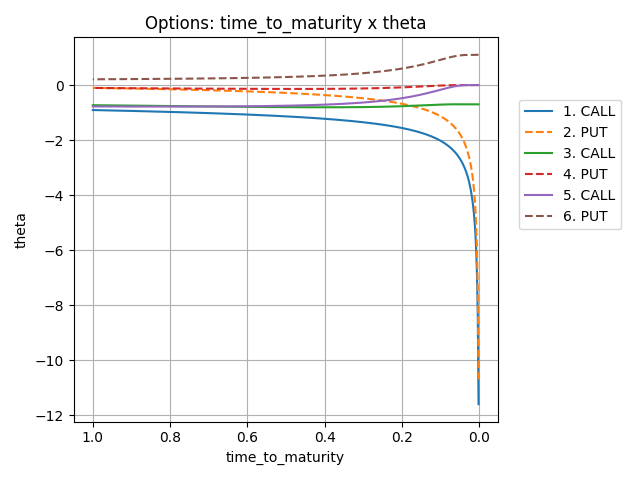

<!----------------------------------------------------------------------------->

# Options Pricing

Precificação de
[Opções](https://conteudos.xpi.com.br/aprenda-a-investir/relatorios/opcoes/)
Europeias utilizando o modelo
***[Black-Scholes](https://pt.wikipedia.org/wiki/Black-Scholes)***.
Este projeto contém a classe `Option`, que realiza todos os cálculos para se
obter o preço de uma opção europeia e os valores de suas principais
variáveis [Gregas](https://en.wikipedia.org/wiki/Greeks_(finance)).
Também é possível realizar a plotagem de gráficos por meio da
função `Option.plot()`, que utiliza as *libs* `pandas` e `matplotlib`.

<!----------------------------------------------------------------------------->
---
### Execução
Para executar o programa, abra o terminal na pasta do código fonte e digite:
```bash
$ python main.py
```

<!----------------------------------------------------------------------------->
---
### Código

- [main.py](main.py)
    - Função principal
- [option.py](option.py)
    - Classe `Option`:
      - ----- *Inputs* -----
      - `type`: Tipo da opção ("CALL" ou "PUT")
      - `strike`: Preço de exercício da opção
      - `dividend`: Rendimento de dividendo da ação
      - `volatility`: Volatilidade da ação
      - `stock_price`: Preço da ação
      - `interest_rate`: Taxa de juros livre de risco anualizada
        ([SELIC](https://www.bcb.gov.br/controleinflacao/taxaselic))
      - `time_to_maturity`: Tempo (em anos) até a data de vencimento da opção
      - ----- *Outputs* -----
      - `delta`: Sensibilidade do preço da opção conforme o preço da ação muda
      - `gamma`: Sensibilidade do *delta* conforme o preço da ação muda
      - `vega`: Sensibilidade do preço da opção conforme a volatilidade da ação muda
      - `theta`: Sensibilidade do preço da opção conforme o tempo passa      
      - `price`: **Preço da opção**
      - `parity`: Paridade CALL-PUT

<!----------------------------------------------------------------------------->
---
### Demonstração

| Index | `Type` | Strike  | Dividend | Volatility | Interest Rate | `Time to Maturity` |
| ----- | ------ | ------- | -------- | ---------- | ------------- | ------------------ |
| 1     | CALL   | R$10,00 | 5%       | 50%        | 2%            | 0.5 year           |
| 2     | PUT    | R$10,00 | 5%       | 50%        | 2%            | 0.5 year           |
| 3     | CALL   | R$10,00 | 5%       | 50%        | 2%            | 0.25 year          |
| 4     | PUT    | R$10,00 | 5%       | 50%        | 2%            | 0.25 year          |
| 5     | CALL   | R$10,00 | 5%       | 50%        | 2%            | 0.05 year          |
| 6     | PUT    | R$10,00 | 5%       | 50%        | 2%            | 0.05 year          |











---

| Index | `Type` | `Strike` | Dividend | Volatility | Stock Price | Interest Rate |
| ----- | ------ | -------- | -------- | ---------- | ----------- | ------------- |
| 1     | CALL   | R$10,00  | 1%       | 25%        | R$10,00     | 10%           |
| 2     | PUT    | R$10,00  | 1%       | 25%        | R$10,00     | 10%           |
| 3     | CALL   | R$8,00   | 1%       | 25%        | R$10,00     | 10%           |
| 4     | PUT    | R$8,00   | 1%       | 25%        | R$10,00     | 10%           |
| 5     | CALL   | R$12,00  | 1%       | 25%        | R$10,00     | 10%           |
| 6     | PUT    | R$12,00  | 1%       | 25%        | R$10,00     | 10%           |










<!----------------------------------------------------------------------------->
